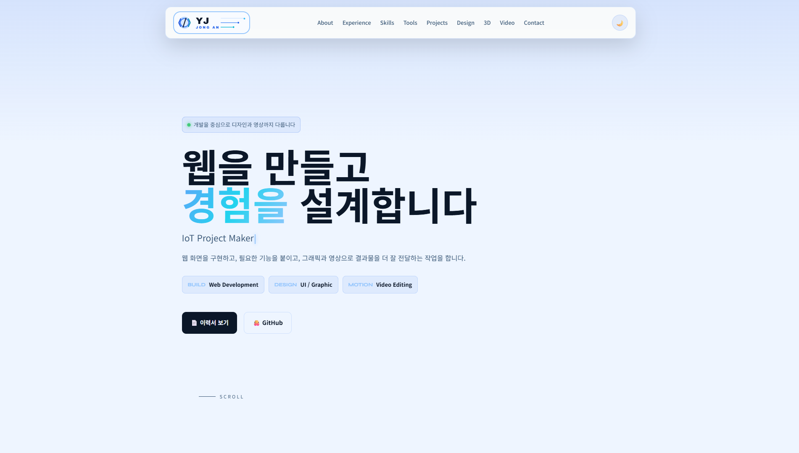

# 유종안 포트폴리오



웹 개발, UI/UX, 그래픽 디자인, 영상 편집, 3D 작업을 한 페이지에서 확인할 수 있는 개인 포트폴리오입니다.

## 주요 구성

- About: 자기소개, 작업 분야, 핵심 수치
- Experience: LMS 개발 및 유지보수, 서버 관리, 업무용 웹/앱 개발 경험
- Skills: HTML/CSS, JavaScript, Java, PHP, SQL, Python, 디자인/영상/3D 작업 역량
- Tools: Photoshop, Illustrator, Premiere Pro, After Effects, Blender
- Projects: 자동 인식 컵 수거기, 스마트 무선 주차 시스템, AI 미래전시 홍보 사이트, 쇼핑몰 페이지
- Design: 배너, 쿠폰, 포스터, 그래픽 작업물
- 3D: Blender 렌더링 및 2D+3D 모션 작업
- Video: Premiere Pro, After Effects 기반 영상 편집 작업

## 사용 기술

- HTML
- CSS
- JavaScript
- Responsive Web

## 주요 작업물

- AI 미래전시 홍보 사이트: HTML/CSS/JavaScript 기반 전시 홍보 페이지, Premiere Pro와 After Effects 영상 콘텐츠 포함
- 쇼핑몰 페이지: 쇼핑몰 화면 흐름 구성, Python 백엔드 작업 경험 포함
- 자동 인식 컵 수거기: Raspberry Pi, Python, Machine Learning 기반 시연 프로젝트
- 스마트 무선 주차 시스템: Arduino, NFC, Bluetooth 기반 주차 상태 확인 프로젝트
- 디자인 작업: Photoshop 중심의 배너, 쿠폰, 포스터, 캐릭터 그래픽
- 3D 작업: Blender 렌더링 후 Premiere Pro 최종 편집

## 실행 방법

별도 빌드 과정 없이 `index.html`을 브라우저에서 열면 됩니다.

```bash
start index.html
```

## 폴더 구조

```text
.
├── index.html
├── README.md
├── resume.pdf
├── cup-collector-plan.pdf
├── images/
└── videos/
```

## 배포

정적 HTML/CSS/JavaScript 포트폴리오이므로 GitHub Pages, Vercel, Netlify 등에 바로 배포할 수 있습니다.