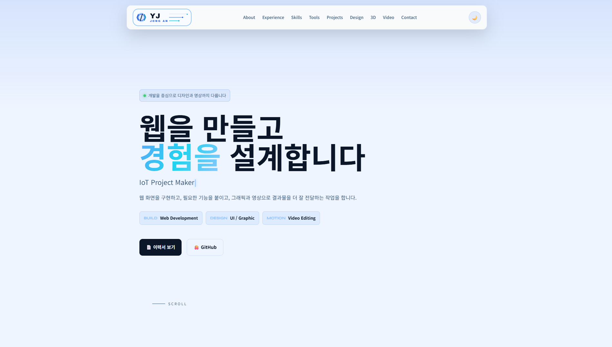

# 유종안 포트폴리오

웹 구현, 데이터 기반 서비스, 지도 API, AI 도구, IoT/임베디드 프로젝트와 디자인/영상/3D 작업을 한 페이지에서 볼 수 있도록 정리한 개인 포트폴리오입니다.

정적인 소개 페이지가 아니라 프로젝트 카드, 상세 모달, 이미지 프리뷰, 영상 섹션, 배포 링크까지 포함한 반응형 웹사이트로 구성했습니다.



## 구성

- About: 자기소개, 작업 방향, 경험 요약
- Experience: LMS 개발 및 유지보수, 서버 관리, 데이터 관리 경험
- Skills: 웹 구현, 프론트엔드, 데이터/API, 디자인·영상·3D 역량
- Projects: 전적 분석, AI 리뷰, 매출 대시보드, 지도 서비스, 학생 운영 관리, 픽업 UX, 커머스, IoT 프로젝트
- Creative: 그래픽 디자인, Blender 3D 렌더링, 영상 편집 작업
- Contact: GitHub, 이력서 연결

## 주요 프로젝트

### Rift Record

Riot Games API를 사용해 League of Legends와 Teamfight Tactics 전적을 분리 조회하고 분석하는 서비스입니다.
검색 직후 프로필, 티어, 최근 15게임 요약, 최근 게임 목록을 먼저 볼 수 있도록 정보 구조를 정리했고, 분석 영역은 접힘 구조로 분리했습니다.
TFT 탭에서는 랭크, 최근 10게임 요약, 유닛/특성/증강체 중심의 카드형 UI를 제공합니다.

- 배포: https://rift-record.vercel.app/
- GitHub: https://github.com/ajttk369/rift-record
- 사용 기술: HTML, CSS, Vanilla JavaScript, Node.js, Riot API, TFT API, Data Dragon, Supabase, Vercel
- 구현 범위: Riot ID 검색, LoL/TFT 탭 분리, 게임 유형 필터, 상세보기 참여자 재검색, 라이트/다크 테마, TFT 한글 데이터 매핑, Supabase 매치 저장

### CareerLens AI 포트폴리오 분석

지원 직무와 선택 채용 공고에 맞춰 포트폴리오 설명의 근거, 개선 작업, 문구 제안과 면접 준비를 정리하는 AI 리뷰 도구입니다. 실제 웹페이지나 디자인 화면을 자동 분석하지 않습니다.
브라우저별 비공개 기록, 진행 저장, 선택 공유와 삭제를 구현하고, 분석 결과 서명과 DB 기반 요청 제한을 코드에 반영했습니다.

- 배포: https://careerlens-ai-kohl.vercel.app/
- GitHub: https://github.com/ajttk369/CareerLens-AI
- 사용 기술: Next.js, TypeScript, OpenAI, Supabase, Tailwind CSS, Vercel

### InsightBoard 매출 분석 대시보드

CSV 매출 데이터를 업로드해 KPI, 차트, 인사이트, 원본 테이블을 확인하는 데이터 대시보드입니다.
Papa Parse로 CSV를 브라우저에서 파싱하고 날짜·숫자·컬럼 형식을 검증합니다. 필터 조건에 맞춰 지표·차트·테이블을 함께 갱신하고, 업로드 오류가 발생하면 기존 데이터를 유지합니다.

- 배포: https://insightboard-xi.vercel.app/
- GitHub: https://github.com/ajttk369/InsightBoard
- 사용 기술: Next.js, TypeScript, Tailwind CSS, Recharts, Papa Parse
- 구현 범위: CSV 입력 검증, KPI 계산, 차트·테이블 필터 연동, 모바일 정렬, 전체 필터 결과 CSV·인쇄 리포트
- 지표 기준: 주문 수는 CSV 행 수, 재구매 비율은 재구매로 표시된 행의 비중입니다. 고객 단위 재구매율은 계산하지 않습니다.

### 지도로 지도 서비스

장소·주소 검색, 상세 정보, 즐겨찾기, 자동차 길찾기와 거리뷰를 지도 중심으로 연결한 웹 서비스입니다.
Naver 지도·검색·좌표·자동차 경로 API와 TAGO 주변 교통 정보를 서버 라우트로 연결했습니다.
대중교통은 주변 버스·지하철 이용 후보이며 환승 경로를 계산하지 않습니다. 도보·자전거는 실제 통행 경로가 아닌 직선 거리 참고 정보를 제공합니다.

- 배포: https://jidoro-map.vercel.app/
- GitHub: https://github.com/ajttk369/jidoro-map
- 사용 기술: Next.js 14, React 18, TypeScript, Tailwind CSS, LocalStorage, Vercel
- 사용 API: Naver Maps JavaScript API, Naver Local Search API, Naver Cloud Geocoding API, Naver Cloud Reverse Geocoding API, Naver Cloud Directions API, TAGO 교통 정보 API
- 구현 범위: 장소·주소 검색, 마커·상세·즐겨찾기, 자동차 실제 경로, 주변 교통 정보, 거리뷰, 모바일 하단 시트

### 학생 관리 시스템

학생 정보와 수강 진도를 관리하고 과정별 운영 현황과 우선 관리 대상을 확인하는 Flask·SQLite 기반 시스템입니다.
검색·필터·정렬·페이지 이동, 과정별 운영 요약, 학생 포털과 CSV 내보내기를 구현했습니다. 운영 메모와 학생 공개 안내를 구분하고 서버 입력 검증·CSRF 보호·요청 제한을 적용했습니다.

- 배포: https://student-lms-manager.onrender.com/
- GitHub: https://github.com/ajttk369/student-lms-manager
- 사용 기술: Python, Flask, SQLite, Flask-WTF, Flask-Limiter, HTML/CSS/JavaScript
- 구현 범위: 학생 CRUD·진도 관리, 과정별 운영 요약, 우선 관리 대상 바로 수정, 학생 공개 안내, 전체 필터 결과 CSV 내보내기
- 관리자·학생 화면의 표시 정보를 구분한 구조이며 실제 회원 인증이나 접근 권한 분리를 제공하지 않습니다.

### 올리브영 픽업 UX 리뉴얼

상품 검색부터 선택 목록 관리, 수량 기반 매장 재고 확인까지 연결한 온라인몰 UX 리뉴얼 프로젝트입니다.
선택 상품·수량 기준으로 전체 가능 매장과 부족한 상품을 계산하고, 매장 선택과 상단 요약을 연결했습니다. 찜·쿠폰·선택 정보 저장과 모바일·모달 사용성을 함께 구현했습니다.

- 배포: https://website-renewal-navy.vercel.app/
- GitHub: https://github.com/ajttk369/Website-Renewal
- 사용 기술: HTML5, CSS3, JavaScript, localStorage, Vercel
- 구현 범위: 검색·필터·상품 상세, 선택 목록·수량 변경, 매장 재고 충족 계산, 매장 선택, 쿠폰 조건, 상태 저장·다른 탭 반영
- 매장 정보는 예시 데이터이며 실제 예약과 회원 인증은 제공하지 않습니다. 사용성 개선은 설계 목표이며 사용자 실험으로 검증한 성과는 아닙니다.

### BLACK FIT 패션 커머스

상품 탐색, 옵션 선택, 장바구니와 주문 내역, 관리자 상품 관리를 연결한 패션 커머스 프로젝트입니다.
프론트엔드는 공통 상품 카탈로그와 localStorage로 동작합니다. 별도 FastAPI 백엔드에는 서버 가격·재고 검증, 요청 제한, JSON 파일 잠금과 원자적 저장을 구현했습니다.

- 배포: https://shopping-mall-rosy.vercel.app/
- GitHub: https://github.com/ajttk369/Shopping-mall
- 사용 기술: HTML, CSS, JavaScript, localStorage, Python, FastAPI, JSON
- 구현 범위: 상품 검색·필터, 사이즈·재고·수량 선택, 장바구니 옵션 변경, 쿠폰·배송비 계산, 모의 주문·주문 내역·관리자 상품 CRUD
- 배포 프론트엔드는 별도 FastAPI API와 자동 연동되지 않습니다. 실제 결제·배송은 제공하지 않습니다.

### AI Future Expo

AI 전시 홍보를 위한 반응형 웹사이트입니다.
전시 정보, 프로그램, 홍보 콘텐츠를 한 화면에서 볼 수 있도록 구성하고 Vercel에 배포했습니다.

- 배포: https://ai-expo-sooty.vercel.app/
- GitHub: https://github.com/ajttk369/AI-Expo
- 사용 기술: HTML, CSS, JavaScript, Premiere Pro, After Effects

### Automatic Cup Collector

Raspberry Pi와 Python을 사용해 컵을 인식하고 분류하는 자동 수거기 프로젝트입니다.
카메라 인식, 분류 흐름, 시연 영상과 기획 자료를 포트폴리오에 함께 정리했습니다.

- 사용 기술: Raspberry Pi, Python, Machine Learning, OpenCV

### Smart Parking System

Arduino, NFC, Bluetooth를 사용한 무선 주차 시스템 프로젝트입니다.
주차 상태 확인과 사용자 인증 흐름을 중심으로 구현했습니다.

- 사용 기술: Arduino, C++, NFC, Bluetooth, IoT

## 기술 스택

- HTML / CSS: 반응형 레이아웃과 화면 스타일 구현
- JavaScript: 검색, 필터, 탭, 상세보기 등 브라우저 인터랙션 구현
- TypeScript / React / Next.js: 타입 기반 화면 구성과 서버 API 라우트 연동
- Python: 관리자 페이지, CRUD, SQLite 기반 데이터 처리
- SQL / Database: 테이블 설계, 조회, 필터링, 운영 데이터 관리
- API Integration: Riot, OpenAI, 지도 API, Supabase 데이터 연동
- UI / UX: 화면 흐름과 사용성 중심의 UI 구성
- Design Tools: Photoshop, Illustrator 기반 그래픽 콘텐츠 제작
- Video Tools: 영상 컷 편집, 자막, 모션 그래픽, 화면 전환 효과 작업
- Blender: 모델링, 조명, 재질 설정, 렌더링 작업
- IoT: Arduino, Raspberry Pi 기반 하드웨어 프로젝트 경험

## Creative 작업

- 그래픽 디자인: 배너, 쿠폰, 포스터, 상품 홍보 이미지
- 3D: Blender 렌더링, 재질/조명 설정, 2D+3D 모션 구성
- 영상: Premiere Pro, After Effects 기반 편집, 자막, 화면 전환, 모션 그래픽

## 로컬 실행

별도 빌드 과정 없이 `index.html`을 브라우저에서 열어 확인할 수 있습니다.

```bash
start index.html
```

## 폴더 구조

```text
.
├─ index.html
├─ README.md
├─ resume.pdf
├─ cup-collector-plan.pdf
├─ images/
└─ videos/
```
